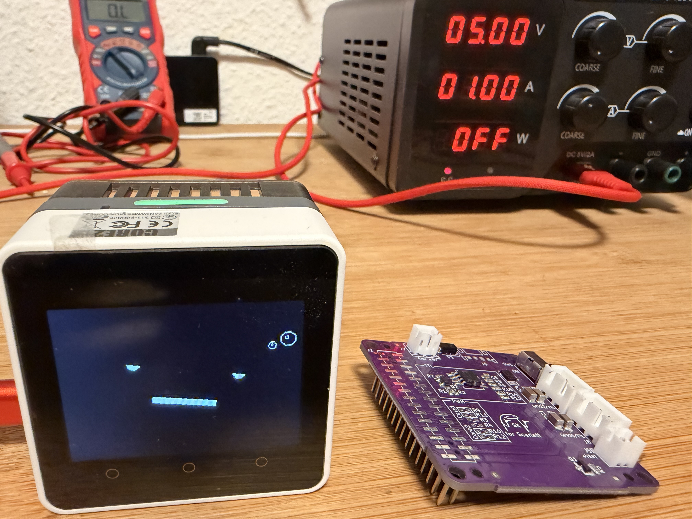

# Stack-chan Core2 — AI Companion with Local LLM



A feature-rich firmware for the **M5Stack Core2** that turns it into a conversational AI desktop companion with an animated face, dual-axis servo head, multi-provider AI backend, and full offline mode via the **M5Stack K144 LLM Module** (AX630C).

---

## Attribution

This project builds on the shoulders of several excellent open-source projects:

| Project | Author | Role |
|---------|--------|------|
| [Stack-chan](https://github.com/stack-chan/stack-chan) | [@meganetaaan](https://github.com/meganetaaan) (Shinya Ishikawa) | Original concept, name, and open-source spirit |
| [M5Stack-Avatar](https://github.com/meganetaaan/m5stack-avatar) | [@meganetaaan](https://github.com/meganetaaan) | Animated face rendering library |
| [AI_StackChan_Ex](https://github.com/ronron-gh/AI_StackChan_Ex) | [@ronron-gh](https://github.com/ronron-gh) | Inspiration for audio pipeline and speaker re-init patterns |
| [M5Unified](https://github.com/m5stack/M5Unified) | M5Stack | Hardware abstraction layer |
| [ESP8266SAM](https://github.com/earlephilhower/ESP8266SAM) | [@earlephilhower](https://github.com/earlephilhower) | Offline SAM TTS engine |
| [M5Module-LLM](https://github.com/m5stack/M5Module-LLM) | M5Stack | K144 / AX630C module driver |
| [WebSockets](https://github.com/Links2004/arduinoWebSockets) | [@Links2004](https://github.com/Links2004) | OpenAI Realtime API WebSocket client |
| [ArduinoJson](https://github.com/bblanchon/ArduinoJson) | [@bblanchon](https://github.com/bblanchon) | JSON serialisation / deserialisation |
| [ESP32Servo](https://github.com/madhephaestus/ESP32Servo) | [@madhephaestus](https://github.com/madhephaestus) | PWM servo control |
| [FTServo](https://github.com/ftservo/feetech-servo-lib) | Feetech / ftservo | TTL SCS smart servo control |

---

## What this project adds

Starting from the original Stack-chan concept and the M5Stack-Avatar library, this firmware adds:

- **Runtime AI provider switching** — Gemini / OpenAI / Claude / OpenAI Realtime / Local — no recompile
- **Full offline mode** via the M5Stack K144 LLM Module (AX630C NPU):
  - Wake-word detection ("HELLO") → streaming ASR (Sherpa-NCNN or Whisper Tiny) → on-device LLM (Qwen2.5-0.5B) → MeloTTS on K144 speaker
  - SAM TTS fallback on the Core2 speaker when K144 TTS is unavailable
  - Streaming per-sentence TTS (Alexa-style latency — first sentence plays while LLM is still generating)
- **OpenAI Realtime API** — bidirectional audio over WebSocket, end-to-end latency < 2 s
- **ElevenLabs TTS** — high-quality streaming voice synthesis, runtime-selectable
- **AES-128-CTR encrypted config** — WiFi password and API keys encrypted at rest on LittleFS, device-bound key
- **Web config UI** at `http://<device-ip>` — edit all settings without recompiling or reflashing
- **Kawaii custom faces** — Default / Cat / Capybara, selectable in the web UI
- **Lip-sync** — mouth open ratio driven from PCM amplitude during all TTS (cloud and SAM)
- **Word-by-word subtitles** inside the avatar face for LOCAL mode (no balloon overlay)
- **Idle breathing animation** — sine-wave servo sway after 30 s of inactivity
- **Emotion → servo sync** — HAPPY nods, ANGRY shakes, SAD tilts down, SURPRISED looks up
- **Prompt-engineering function calls** — `[ACT:nod/shake/left/right/up]` tags let the LLM trigger servo actions (LOCAL mode)
- **Dual servo mode** — PWM (SG90-class) or TTL SCS (Feetech SCS0009), selected at first boot and saved to NVS
- **Runtime servo calibration** via web UI — no recompile needed to adjust pan/tilt limits
- **NTP date/time injection** — current date/time auto-prepended to system prompt once WiFi connects
- **Boot progress display** during K144 module initialisation

---

## Hardware

| Required | Notes |
|----------|-------|
| M5Stack Core2 | ESP32, 240 MHz, 16 MB flash, 4 MB PSRAM |

| Optional | Notes |
|----------|-------|
| 2× SG90-class servos | PWM mode — GPIO 32 (tilt), GPIO 33 (pan) |
| 2× Feetech SCS0009 | TTL SCS mode — UART2 GPIO 13 TX / 14 RX, 1 Mbps |
| M5Stack K144 LLM Module | LOCAL provider — connects on Port C (GPIO 13/14). **Conflicts with TTL SCS servo — use PWM servo mode with K144** |

---

## Quick start

### 1. Copy and configure

```bash
cp src/ai_config.h.example src/ai_config.h
cp data/config.json.example data/config.json
```

Edit `src/ai_config.h` — at minimum set your WiFi credentials and one API key, and choose a provider:

```cpp
#define WIFI_SSID      "your-ssid"
#define WIFI_PASSWORD  "your-password"
#define GEMINI_API_KEY "AIza..."
#define AI_PROVIDER    AI_PROVIDER_GEMINI
```

### 2. Build and upload

Open the project in VS Code with the PlatformIO extension:

- **Build + upload firmware:** click the Upload button (→) or `Ctrl+Alt+U`
- **Upload filesystem** (first time only, to write `data/config.json`): run `pio run -t uploadfs`

After the first `uploadfs`, all config changes can be made via the web UI — no re-flashing needed.

### 3. Connect and configure

- On first boot: if WiFi fails, the device starts an AP named **`stackchan-config`**. Connect to it and open `http://192.168.4.1`.
- On successful WiFi connection: open `http://<device-ip>` shown on the display.
- The web UI lets you change WiFi, API keys, AI provider, model names, face style, greeting, servo limits, and more — all without recompiling.

### 4. Talk to it

Hold **Button B** (middle), speak, release. Stack-chan transcribes, thinks, and answers aloud.

---

## AI providers

| Provider | STT | LLM | TTS | Notes |
|----------|-----|-----|-----|-------|
| `gemini` | Gemini (audio inline) | `g_chat_model` | `g_gemini_tts_model` | One API key |
| `openai` | Whisper-1 | `g_chat_model` | OpenAI TTS (`tts-1`) | One API key |
| `claude` | Whisper-1 (OpenAI key) | `g_chat_model` | OpenAI TTS (`tts-1`) | Two API keys |
| `realtime` | GPT-4o Realtime | GPT-4o Realtime | GPT-4o Realtime | < 2 s latency, one API key |
| `local` | K144 KWS + ASR | K144 LLM (Qwen2.5) | K144 MeloTTS / SAM | Fully offline, K144 module required |

**TTS override:** set `g_tts_provider` to `"elevenlabs"` in the web UI to route all cloud providers through ElevenLabs TTS (requires ElevenLabs key).

**SAM fallback:** all cloud providers fall back to the offline SAM voice synthesiser on any TTS HTTP error.

---

## LOCAL provider — M5Stack K144 Module

The K144 module connects via UART2 (Port C). It runs [StackFlow](https://github.com/m5stack/StackFlow) on an AX630C NPU.

### Required packages on K144 (install via ADB/SSH)

```bash
# Core services (likely pre-installed on StackFlow v1.5+)
apt install llm-kws llm-asr llm-melotts

# Models
apt install llm-model-qwen2.5-0.5B-ax630c   # recommended LLM
apt install llm-model-melotts-en-default     # English TTS

# For Whisper STT (alternative to Sherpa-NCNN)
apt install llm-whisper llm-model-whisper-tiny
```

### ASR options

| Value in web UI | Engine | Notes |
|-----------------|--------|-------|
| `sherpa-ncnn` | Sherpa-NCNN streaming | Default, low latency, confirmed working |
| `whisper-tiny` | Whisper Tiny | Higher accuracy, ~30 s chunks |

### LLM models

| Model | Notes |
|-------|-------|
| `qwen2.5-0.5B-prefill-20e` | Recommended — fast, no tokenizer service needed |
| `qwen2.5-1.5B-ax630c` | Smarter, needs `qwen-tokenizer` systemd service on K144 |
| `qwen3-0.6B-ax630c` | Latest Qwen, has chain-of-thought overhead, needs high `max_tokens` |

### Power note

On USB power, ensure `g_k144_volume` stays at `0` (default) in the web UI — the K144 speaker amp draws a current spike on wake-word events that can trigger ESP32 brownout on weak USB supplies. Increase volume only on a proper power bank or mains adapter.

---

## Controls

| Action | Result |
|--------|--------|
| Hold Button B | Record voice → AI conversation |
| Short-tap Button A | Happy expression + nod |
| Short-tap Button C | Clear conversation history |
| Long-hold Button C (≥ 1.5 s) | Run servo calibration test sequence |
| Hold Button A at boot | Re-run servo mode selector |
| Touch top of screen | Happy expression |
| Touch bottom of screen | Sleepy expression |
| Touch sides | Doubt / look left / look right |

---

## Face styles

| Style | Description |
|-------|-------------|
| `default` | Standard M5Stack-Avatar ellipse face |
| `cat` | Kawaii cat — round eyes with slit pupil, ears, blush, heart nose, whiskers |
| `capybara` | Kawaii capybara — squinted eyes, oversized blush, oval snout |

Select in the web UI **Personality** card → **Face Style** dropdown. Takes effect after save + restart.

---

## Project structure

```
stackchan-core2/
├── platformio.ini              # Build config, libraries, flags
├── src/
│   ├── main.cpp                # Boot, main loop, AI orchestration
│   ├── ai_config.h.example     # Config template — copy to ai_config.h and fill in
│   ├── ai_client.h             # STT + LLM (Gemini / OpenAI / Claude)
│   ├── realtime_client.h       # OpenAI Realtime API WebSocket
│   ├── tts_client.h            # TTS streaming, ElevenLabs, lip-sync, SAM fallback
│   ├── audio_recorder.h        # Mic DMA recording + WAV construction
│   ├── local_llm.h             # K144 module — KWS, ASR, LLM, MeloTTS pipeline
│   ├── config_store.h          # Runtime config load/save + AES-128-CTR encryption
│   ├── config_webserver.h      # Web config UI (served at http://<device-ip>)
│   ├── avatar_faces.h          # Custom face definitions (Cat, Capybara, SubtitleOverlay)
│   ├── stackchan_servo.h       # PWM + TTL SCS servo, animations, idle breathing
│   ├── stackchan_expression.h  # Avatar expression wrapper + true-black theme
│   ├── stackchan_audio.h       # Tone generation, speaker config
│   ├── conversation_ui.h       # UI overlays — recording, thinking, response, subtitles
│   ├── init_screen.h           # Servo mode selector UI
│   ├── servo_mode.h            # Servo mode NVS persistence
│   └── wake_word.h             # Wake word detection (disabled — needs VAD calibration)
├── data/
│   └── config.json.example     # Runtime config template — copy to config.json and fill in
├── lib/
│   └── AudioOutputStub/        # Minimal AudioOutput stub for ESP8266SAM (avoids ESP8266Audio I2S conflict)
└── scripts/
    └── version.py              # Build-time version string injection
```

---

## Known limitations

- Wake word ("Oye chispita") is implemented but disabled — ambient noise floor needs calibration before enabling. See `src/wake_word.h`.
- No certificate pinning on HTTPS — uses `setInsecure()` to work within ESP32 heap constraints.
- Conversation history is not persisted across reboots (SRAM only, 4 pairs).
- `pio run -t uploadfs` overwrites `data/config.json` on LittleFS, erasing any saved config. Only use it for first-time setup.

---

## License

MIT — see individual library licenses for their respective terms.
